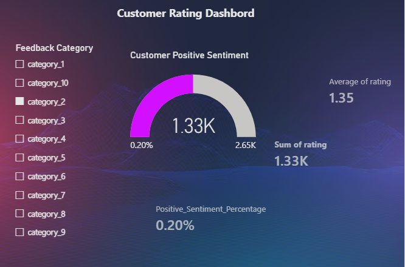

# ✈️ End-to-End Travel Reviews Data Pipeline & Analytics

An automated data engineering and analytics project that extracts raw customer review records, cleanses and processes the rows using Python, hosts it in a relational MySQL database server, and visualizes interactive business trends through a polished Power BI dashboard.

## 🏗️ Project Architecture
The data pipeline flows across the following components:
[UCI Repository API] ➔ [Python Pandas (ETL)] ➔ [MySQL Database] ➔ [Power BI Dashboard]

## 📊 Dashboard Preview

## 🛠️ Core Technologies Used
* **Data Processing:** Python 3.14 (Pandas, SQLAlchemy, PyMySQL)
* **Data Warehousing:** MySQL Server 8.0
* **Business Intelligence:** Power BI Desktop (DAX Modeling)

## 🧹 Python ETL Operations Done
* Loaded **9,800 rows** of raw traveller reviews from the UCI Repository.
* Handled structural data changes and missing entry values using column averages.
* Standardized anonymous column layout formats into relational tables.
* Engineered a binary metric column (`is_satisfied`) to flag ratings above a 3.0 scale threshold.

## 📊 Core Business Insights Discovered
* **Low Customer Sentiment:** The baseline travel sentiment percentage rests at a critical low of **14.0%**, indicating heavily unsatisfied tourists across the global travel sectors.
* **Sector Underperformance:** The global baseline **Average Rating tracks at just 1.70 out of 5.0**, exposing major customer experience flaws.
* **Interactive Breakdown:** Built dynamic cross-filtering visual components so stakeholders can instantly isolate local performance issues across individual travel categories (Categories 1-10).
